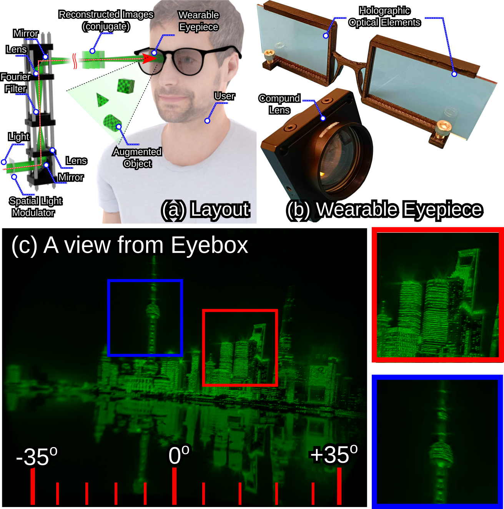

# HoloBeam: Paper-Thin Near-Eye Displays
[Kaan Akşit](https://kaanaksit.com)
and [Yuta Itoh](https://www.ar.c.titech.ac.jp/people/yuta-itoh)




[\[Website\]](https://complightlab.com/publications/holobeam), [\[Manuscript\]](https://arxiv.org/abs/2212.05057) 


## Description
In this repository you will find the codebase for the learned model discussed in our work.
This work extends our previous [optimization Computer-Generated Holography (CGH) pipeline](https://github.com/complight/realistic_defocus) by converting it into a learned model.
If you need support beyond these `README.md` files, please do not hesitate to reach us using `issues` section.


# Citation
If you find this repository useful for your research, please consider citing our work using the below `BibTeX entry`.
```bibtex
@ARTICLE{aksit2023holobeam,
  title    = "HoloBeam: Paper-Thin Near-Eye Displays",
  author   = "Akşit, Kaan and Itoh, Yuta",
  journal  = "IEEE VR 2023",
  month    =  March,
  year     =  2023,
  language = "en",
}
```

## Getting started
This repository contains a code base for estimating holograms that can be used to generate multiplanar images without requiring depth information.


### (0) Requirements
Before using this code in this repository, please make sure to have the right dependencies installed.
In order to install the main dependency used in this project, please make sure to use the below syntax in a Unix/Linux shell:


```bash
pip3 install git+https://github.com/kaanaksit/odak
```


### (1) Runtime
Once you have the main dependency installed, you can run the code base using the default settings by providing the below syntax:

```bash
git clone git@github.com:complight/holobeam_multiholo.git
```
```bash
cd holobeam_multiholo
```
```bash
python3 main.py
```


### (2) Reconfiguring the code for your needs
Please consult the settings file found in `settings/sample.txt`, where you will find a list of self descriptive variables that you can modify according to your needs.
This way, you can create a new settings file or modify the existing one.
By typing,
```bash
python3 main.py --help
```
You can reach to the information for training and estimating using this work.


If you are willing to use the code with another settings file, please use the following syntax:
```bash
python3 main.py --settings settings/sample.txt
```


## Support
For more support regarding the code base, please use the issues section of this repository to raise issues and questions.
